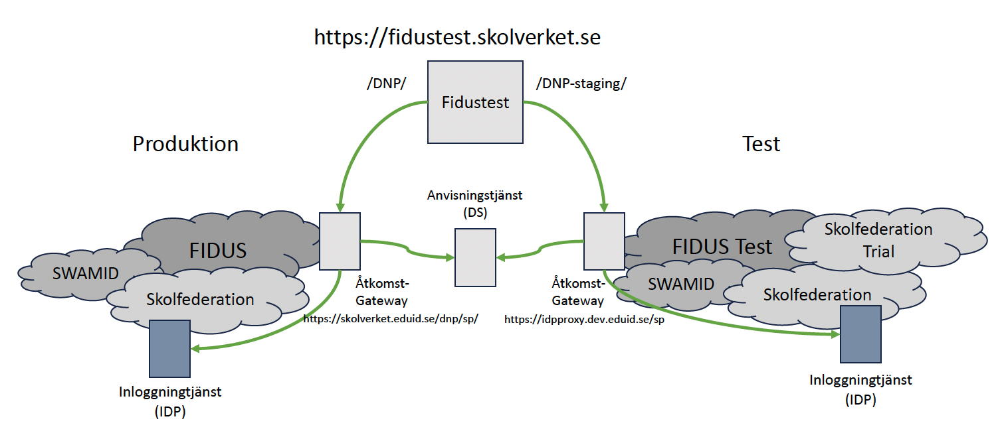

# dnp-access-management
Skolverket digitaliserar de nationella proven (DNP).

I Skolverkets bibliotek DNP åtkomsthantering finns dokumentation som
beskriver hur åtkomst hanteras i Skolverkets provtjänst.

## Testmiljö för tester av inloggning mot Skolverkets provtjänst

Skolverket tillhandahåller en testmiljö för tekniska verifieringstester där inloggning mot provtjänsten kan testas för olika scenarion med och utan e-legitimation. Ingången för testerna är Fidustest som är en service provider som ingår både i federationerna FIDUS (produktion) och FIDUS Test. Se länkar under bild.

>https://fidustest.skolverket.se/DNP/

Används för tester mot FIDUS i produktion dvs samma tekniska miljö som Skolverkets provtjänst i produktion använder.

>https://fidustest.skolverket.se/DNP-staging/

Är en separat testmiljö som även innefattar federationers testmiljöer tex Skolfederation Trial. Den här miljön har ingen koppling till Skolverkets provtjänst i produktion.

## Tekniska checklistor för inloggning mot Skolverkets provtjänst

>[Checklista för inloggning med egen IDP utan e-legitimation](https://github.com/skolverket/dnp-access-management/blob/main/checklists/Inloggning%20med%20egen%20IDP%20utan%20e-legitimation.md)

Den här checklistan riktar sig till alla skolhuvudmän med egen inloggningstjänst (IDP) som ska
användas för inloggning mot provtjänsten.

>[Checklista för inloggning med egen IDP-ansluten
e-legitimation](https://github.com/skolverket/dnp-access-management/blob/main/checklists/Inloggning%20med%20egen%20IDP-ansluten%20e-legitimation.md)

Den här checklistan riktar sig till de skolhuvudmän som har en egen IDP-ansluten e-legitimation
godkänd av DIGG på tillitsnivå 2, 3 eller 4. Observera att checklistan för inloggning utan e-legitimation bör gås igenom före denna checklista.

>[Checklista för inloggning med egen IDP och eduID som e-legitimation](https://github.com/skolverket/dnp-access-management/blob/main/checklists/Inloggning%20med%20egen%20IDP%20och%20eduID%20som%20e-legitimation.md)

Den här checklistan riktar sig till alla skolhuvudmän som ska använda eduID som e-legitimation. Observera att checklistan för Inloggning utan e-legitimation bör gås igenom före denna checklista.

## FAQ
Här samlar vi svar på vanliga förekommande frågor och lösningar på problem som andra användare stött på i samband med uppsättning av inloggning mot Skolverkets provtjänst.
>[Till FAQ](https://github.com/skolverket/dnp-access-management/blob/tomasericsson70-patch-1/docs/FAQ.md)

## Mer information om åtkomst för skolpersonal till Skolverkets provtjänst 
Det övergripande kravet för skolpersonals åtkomst till Skolverkets provtjänst
är att e-legitimering ska ske på tillitsnivå 2, 3 eller 4 enligt
[Tillitsramverket för kvalitetsmärket Svensk e-legitimation](https://www.digg.se/digitala-tjanster/e-legitimering/tillitsnivaer-for-e-legitimering/tillitsramverk-for-svensk-e-legitimation) vid hantering och genomförande av digitala nationella prov och bedömningsstöd i Skolverkets provtjänst.

Grundförutsättningen för att personal ska kunna ansluta sig till Skolverkets provtjänst är att e-legitimeringen sker med en av DIGG godkänd e-legitimation på tillitnivå 2, 3 eller 4. Skolverket ställer inte krav på att själva inloggningstjänsten (IdP) ska vara granskad och godkänd av DIGG. Identiteten på den som ansluter ska presenteras i form av ett EPPN som också måste finnas provisionerat i provtjänsten. För att inloggningtjänsten (IdP) på ett korrekt sätt ska kunna presentera detta för Skolverkets provtjänst finns vissa förutsättningar.

>[Läs mer om kravet för skolpersonals åtkomst och signalering av tillitsnivå](https://github.com/skolverket/dnp-access-management/blob/9b23ec8b215df76415846c92deabedb8f1879288/docs/Signalering%20av%20tillitsniva%CC%8A%20till%20Skolverkets%20provtja%CC%88nst%20vid%20inloggning%20med%20e-legitimation.pdf)

**Notera att arbetet med digitala nationella prov (DNP) är ett pågående projekt och att
materialet i DNP användarhantering uppdateras kontinuerligt.** Det är inte fastställd
information från Skolverket, utan dokumenten kommer att uppdateras.

## Kontakt
https://www.skolverket.se/kontakt
